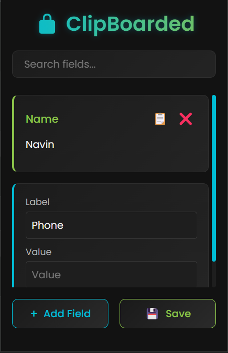

# 🔒 ClipBoarded – Quick Copy Personal Info Extension

**ClipBoarded** is a lightweight, stylish Chrome extension that helps you store and quickly copy your most frequently used personal information—like your name, phone number, email, LinkedIn profile, and more. Whether you're job hunting, filling out forms, or registering for services, ClipBoarded makes it easy to manage and access your essential info.

---

## Version Updates

**v1.1.0 – July 2025**

- 📤 **Export to JSON**: Download all saved fields as a JSON file.
- 📥 **Import from JSON**: Restore fields from a backup JSON file.
- 🔍 **Search Enhanced**: Improved search across labels and values.
- 🖱️ **UI Improvements**: Better scroll behavior for long fields and buttons.

---

## ✨ Features

- ✅ **Predefined Fields**: Starts with basic fields like Name and Phone Number.
- ➕ **Custom Fields**: Add any number of new label-value pairs as needed.
- 🔒 **Locked After Save**: Once saved, fields become non-editable to prevent accidental changes.
- 📋 **One-Click Copy**: Instantly copy any value with a single click.
- ❌ **Delete Fields**: Remove unused fields when they're no longer needed.
- 💾 **Persistent Storage**: All fields are saved in Chrome’s local storage.
- 🖥️ **Sleek UI**: Dark theme, responsive layout, and minimal design with scrollable fields.

---

## 📸 Preview



---

## 🚀 Installation

1. **Clone the repo** or [Download ZIP](https://github.com/NavinSubramanian/Clipboarded/archive/refs/heads/main.zip)
2. Open **Chrome** and navigate to `chrome://extensions/`
3. Enable **Developer Mode** (top right).
4. Click **Load unpacked** and select the project folder.
5. Pin the **ClipBoarded** icon from the extensions toolbar for quick access!

---

## 📁 Project Structure

```
clipboarded/
├── images/              # All the needed images
├── css/                 # Contains the style sheets
├── popup.html           # Main popup UI
├── popup.js             # Core logic for adding, copying, deleting fields
├── manifest.json        # Chrome extension configuration
├── Logo.png             # Extensions main image
└── README.md            # You're reading it!
```

---

## 🛠️ Built With

- **HTML5** – Clean and structured markup
- **CSS3** – Sleek, modern dark UI with scrollable sections
- **JavaScript (Vanilla)** – Logic for storage, DOM interaction, and clipboard
- **Chrome Extension API v3** – Modern and secure extension architecture

---

## 💡 Future Improvements

- 🔐 Optional field encryption
- ☁️ Chrome sync support across devices
- 🧹 Context menu integration for even faster access
- 🌐 Autofill support on websites (optional toggle)

---

## 🤝 Contribution Guide

Want to improve ClipBoarded? Contributions are welcome!

1. Fork the repository
2. Create your feature branch: `git checkout -b feature/your-feature-name`
3. Commit your changes: `git commit -m 'Add some feature'`
4. Push to the branch: `git push origin feature/your-feature-name`
5. Open a Pull Request

Please follow existing code style and conventions when contributing.

---

## 📄 License

MIT License © 2025 [Navin](https://github.com/NavinSubramanian/)

---

## 🔗 Resources

- [Chrome Extension Docs](https://developer.chrome.com/docs/extensions/mv3/)
- [Clipboard API Guide](https://developer.mozilla.org/en-US/docs/Web/API/Clipboard_API)
- [Using Chrome Storage](https://developer.chrome.com/docs/extensions/reference/storage/)

---

> ⚡ ClipBoarded – Because your info should always be one click away.
