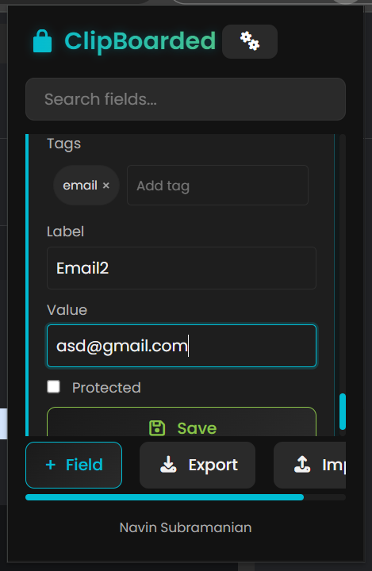
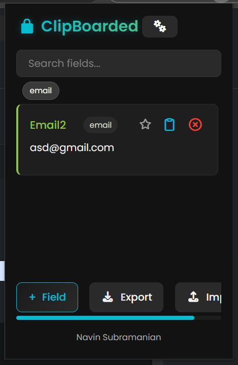

# 🔒 ClipBoarded – Quick Copy Personal Info Extension

**ClipBoarded** is a lightweight, stylish Chrome extension that helps you store and quickly copy your most frequently used personal information—like your name, phone number, email, LinkedIn profile, and more. Whether you're job hunting, filling out forms, or registering for services, ClipBoarded makes it easy to manage and access your essential info.

---

## Latest Version Updates

**v1.4.0 – Organization Update (Jan 2026)**  
- 🏷️ **Added Tags**  
  - Now you can add tags to the field and save them
  - Near the search filter you can view the different tags present
  - Click them to filter

- 😎 **Better Life Update**  
  - Added close button when creating a field to close the prompt
  - Made the save button bigger
  - Few more UI modification

- 📤 **Future Enhancement on Development**
  - The feature to toggle between Light and Dark theme (For any Light theme freaks!)
  - Testing on the UI

👉 [View all releases](https://github.com/NavinSubramanian/Clipboarded/releases)

---

## ✨ Features

- ✅ **Predefined Fields**: Starts with basic fields like Name and Phone Number.
- ➕ **Custom Fields**: Add unlimited label–value pairs.
- 🔒 **Protected Fields**: Secure selected fields with a password.
- 👁️ **Password-Gated Reveal**: Reveal protected values only after authentication.
- 📤 **Secure Export**: Export data only after password verification.
- ⭐ **Pin Fields**: Keep important fields pinned at the top.
- 🏷️ **Tags**: You can create tags to the field and filter them by that for easy access.
- 🔐 **Locked After Save**: Fields lock automatically after saving.
- 📋 **One-Click Copy**: Copy values instantly when unlocked.
- ❌ **Delete Fields**: Remove unwanted fields safely.
- 💾 **Local-Only Storage**: All data stays on your device—no servers, no tracking.
- 🖥️ **Clean Dark UI**: Minimal, fast, and distraction-free.

---

## 📸 Preview

- Field Creation


- Filter by Tags


---

## 🚀 Installation

1. **Clone the repo** or [Download ZIP](https://github.com/NavinSubramanian/Clipboarded/archive/refs/heads/main.zip)
2. Open **Chrome** and navigate to `chrome://extensions/`
3. Enable **Developer Mode** (top right).
4. Click **Load unpacked** and select the project folder.
5. Pin the **ClipBoarded** icon from the extensions toolbar for quick access!

---

## 📁 Project Structure

```
clipboarded/
├── assets/              # Needed assests like fontawesome icons
├── images/              # All the needed images
├── css/                 # Contains the style sheets
├── popup.html           # Main popup UI
├── popup.js             # Core logic for adding, copying, deleting fields
├── manifest.json        # Chrome extension configuration
├── Logo.png             # Extensions main image
└── README.md            # You're reading it!
```

---

## 🛠️ Built With

- **HTML5** – Clean and structured markup
- **CSS3** – Sleek, modern dark UI with scrollable sections
- **JavaScript (Vanilla)** – Logic for storage, DOM interaction, and clipboard
- **Chrome Extension API v3** – Modern and secure extension architecture
- **Fontawesome** - Library used for the icon style

---

## 💡 Future Improvements

- 🌙 Dark/Light theme toggle [In Development]
- 🔐 Optional field encryption
- ☁️ Chrome sync support across devices
- 🧹 Context menu integration for even faster access
- 🌐 Autofill support on websites (optional toggle)

---

## 🤝 Contribution Guide

Want to improve ClipBoarded? Contributions are welcome!

1. Fork the repository
2. Create your feature branch: `git checkout -b feature/your-feature-name`
3. Commit your changes: `git commit -m 'Add some feature'`
4. Push to the branch: `git push origin feature/your-feature-name`
5. Open a Pull Request

Please follow existing code style and conventions when contributing.

---

## 📄 License

MIT License © 2025 [Navin](https://github.com/NavinSubramanian/)

---

## 🔗 Resources

- [Chrome Extension Docs](https://developer.chrome.com/docs/extensions/mv3/)
- [Clipboard API Guide](https://developer.mozilla.org/en-US/docs/Web/API/Clipboard_API)
- [Using Chrome Storage](https://developer.chrome.com/docs/extensions/reference/storage/)

---

> ⚡ ClipBoarded – Because your info should always be one click away.
